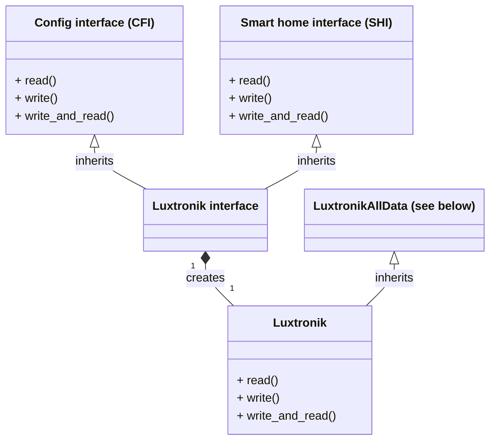
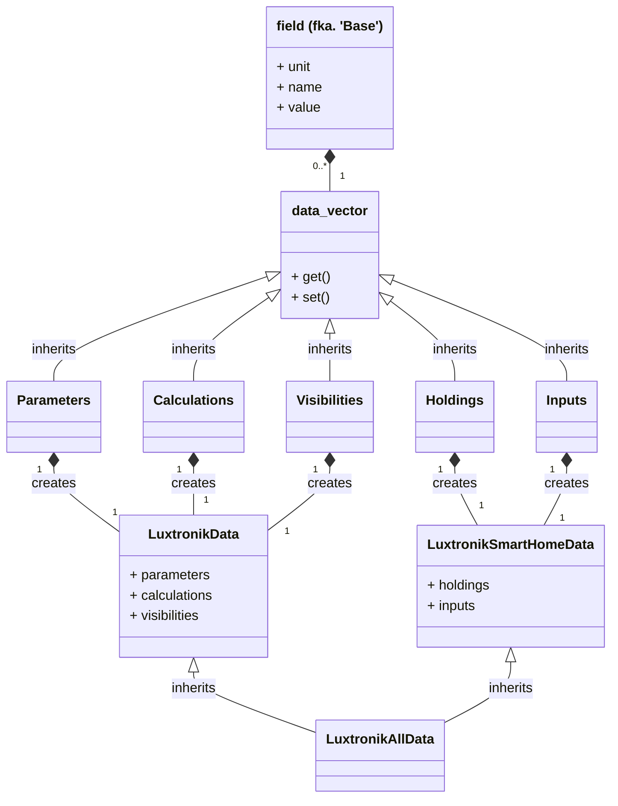

# luxtronik

python-luxtronik is a Python library that allows you to interact with a
Luxtronik heat pump controller programmatically. This enables you to read
values from the heat pump and write values back to the heat pump, thus
influencing its behaviour.

## BACKGROUND

Luxtronik is a heat pump control system developed by Alpha Innotec that is used
by several manufactures. Essentially it is the part of the heat pump system
that the user can interact with locally via display and setting dial.

The (permanent) configuration of the heat pump is addressed via a TCP socket
that is exposed via network (typically on port 8889)
and is referred to here as config interface (CFI). Values can be read from
and written to the heat pump, essentially making it
controllable from within a Python program.

Additional (volatile) control and status registers are also available
specifically for integration into a smart home system. To use this, you must
first activate the smart home interface (SHI) in the settings, after which
they can be accessed via Modbus TCP (port 502, No BMS/GLT license required).

This allows you, for example, to change the temperature settings of your heat
pump or get current temperature values from the heat pump, similar to what you
can do when controlling the heat pump locally on-site.

Unfortunately there is no official documentation of this API, and how to
interact with it. As such, the **implementation is heavily based on reverse
engineering**.

## INSTALLATION

This library can be installed via pip by issuing the following command:

```shell
pip install luxtronik
```

Afterwards the module can be used like any other Python module, i.e. it can
be imported via `import luxtronik` from your Python scripts.

If you want to install the latest version from the git repo you can do that
with the following command:

```shell
pip install git+https://github.com/Bouni/python-luxtronik.git@main
```

## MODULE STRUCTURE



The library has a modular structure, so that all interfaces
can be used separately. The basic functionality of both is provided
as a common `LuxtronikInterface` or, with integrated data vectors,
as `Luxtronik`. These should be suitable for most applications.

The further documentation here refers to the general interface.
Details on the additional functions and the API of the config interface
and the smart home interface can be found in their separate README files
[luxtronik/cfi/README.md](luxtronik/cfi/README.md) and
[luxtronik/shi/README.md](luxtronik/shi/README.md).

## DATA STRUCTURE

A concise overview of the data structures that users typically use:



The heat pump data is stored in so-called `fields` and can be retrieved
from there in a user-friendly format. Several fields of the same type are
combined into a `data_vector`, which works like a field-dictionary.

The CFI uses `LuxtronikData`, the SHI uses `LuxtronikSmartHomeData`,
and the general interfaces uses `LuxtronikAllData`.

## DOCUMENTATION

There is no automatically rendered documentation of this library available yet,
so you'll have to fall back to using the source code itself as documentation.
It can be found in the [luxtronik](luxtronik/) directory.

At least for the data fields, there is such a
[documentation](https://bouni.github.io/python-luxtronik/). Alternatively,
you can take a look at the definitions for all discovered data fields:

- Calculations holds measurement values (config interface): \
[luxtronik/definitions/calculations.py](luxtronik/definitions/calculations.py)

- Parameters holds parameter values (config interface): \
[luxtronik/definitions/parameters.py](luxtronik/definitions/parameters.py)

- Visibilities holds visibility values (config interface),
the function of visibilities is not clear at this point: \
[luxtronik/definitions/visibilities.py](luxtronik/definitions/visibilities.py)

- Inputs holds read-only values (smart home interface): \
[luxtronik/definitions/inputs.py](luxtronik/definitions/inputs.py)

- Holdings holds read-and-writeable values (smart home interface): \
[luxtronik/definitions/holdings.py](luxtronik/definitions/holdings.py)

## EXAMPLE USAGE

### READING VALUES FROM THE HEAT PUMP

The following example reads in data from the heat pump:

```python
from luxtronik import Luxtronik

l = Luxtronik('192.168.1.23', 8889, True, 502)
# There is an initial reading during creation
heating_limit = l.parameters.get("ID_Einst_Heizgrenze_Temp")

# Do something else here...

# Read the values again
l.read()
t_forerun = l.calculations.get("ID_WEB_Temperatur_TVL")
t_outside = l.calculations.get("ID_WEB_Temperatur_TA")

# alternatively get also works with numerical ID values
t_forerun = l.calculations.get(10)

print(t_forerun) # this returns the temperature value of the forerun, 22.7 for example
print(t_forerun.unit) # gives you the unit of the value if known, °C for example

# or via Modbus TCP
t_flowline = l.inputs["flow_line_temp"]

print(t_flowline) # returns 22.7 for example again
```

The method `read()` reads all those data vectors (calculations, parameters,
inputs, ...) from the heat pump. Alternatively `read_parameters()`,
`read_calculations()`, `read_visibilities()`, `read_inputs()`
or `read_holdings()` can be used.

Note that an initial read operation is carried out in the constructor.

Similarly, only the interface can be used:

```python
from luxtronik import LuxtronikInterface

l = LuxtronikInterface('192.168.1.23', 8889, 502)
# Read all data from the heatpump
data = l.read()

t_forerun = data.calculations["ID_WEB_Temperatur_TVL"]
if t_forerun.value > 30:
#...
```

### SCRIPTS AND COMMAND LINE INTERFACE (CLI)

Once installed, the luxtronik package provides several scripts that can be used
to interact with your heatpump. Those scripts can be invoked like regular
commands from the command line.

#### DISCOVERY OF AVAILABLE HEATPUMPS WITHIN THE NETWORK

Heat pumps can be discovered in a network by sending broadcast packages that
the Luxtronik controller will reply to. This can be done with the `discover`
sub command in the following way:

```sh
luxtronik discover
```

```sh
1 heatpump(s) reported back
Heat pump #0 -> IP address: 192.168.178.123 port: 8889
```

#### DUMP ALL DATA

To get all data available you can either use the CLI:

```sh
luxtronik dump-cfi 192.168.178.123 8889

# or analog for Modbus TCP register
luxtronik dump-shi 192.168.178.123 502
```

or call the script that comes with the python package:

```python
PYTHONPATH=. ./luxtronik/scripts/dump_cfi.py 192.168.178.123 8889

# or from the base folder of luxtronik
python -m luxtronik dump-shi 192.168.178.123 502
```

The output of this script can be used to backup all values (e.g. before
modifying them) and to get a better understanding about parameters (e.g. by
looking for differences when comparing the output after doing some changes
locally, etc.).

You'll get a long list of all data, like this (truncated):

```txt
================================================================================                                                                                                                                 │
                                   Parameter                                                                                                                                                                     │
================================================================================                                                                                                                                 │
Number: 0     Name: ID_Transfert_LuxNet                                          Type: Unknown              Value: 0                                                                                             │
Number: 1     Name: ID_Einst_WK_akt                                              Type: Celsius              Value: 1.0                                                                                           │
Number: 2     Name: ID_Einst_BWS_akt                                             Type: Celsius              Value: 50.0                                                                                          │
Number: 3     Name: ID_Ba_Hz_akt                                                 Type: HeatingMode          Value: Off                                                                                           │
Number: 4     Name: ID_Ba_Bw_akt                                                 Type: HotWaterMode         Value: Automatic                                                                                     │
Number: 5     Name: ID_Ba_Al_akt                                                 Type: Unknown              Value: 4                                                                                             │
Number: 6     Name: ID_SU_FrkdHz                                                 Type: Unknown              Value: 1167609600                                                                                    │
Number: 7     Name: ID_SU_FrkdBw                                                 Type: Unknown              Value: 1167609600                                                                                    │
Number: 8     Name: ID_SU_FrkdAl                                                 Type: Unknown              Value: 0                                                                                             │
Number: 9     Name: ID_Einst_HReg_akt                                            Type: Unknown              Value: 0                                                                                             │
Number: 10    Name: ID_Einst_HzHwMAt_akt                                         Type: Unknown              Value: -200                                                                                          │
Number: 11    Name: ID_Einst_HzHwHKE_akt                                         Type: Celsius              Value: 33.0                                                                                          │
Number: 12    Name: ID_Einst_HzHKRANH_akt                                        Type: Celsius              Value: 22.0                                                                                          │
Number: 13    Name: ID_Einst_HzHKRABS_akt                                        Type: Celsius              Value: 0.0                                                                                           │
Number: 14    Name: ID_Einst_HzMK1E_akt                                          Type: Unknown              Value: 330                                                                                           │
Number: 15    Name: ID_Einst_HzMK1ANH_akt                                        Type: Unknown              Value: 220                                                                                           │
Number: 16    Name: ID_Einst_HzMK1ABS_akt                                        Type: Unknown              Value: 0
...
```

#### SHOW CHANGED VALUES ONLY

There is another sub-command (`watch-cfi`, `watch-shi`) and/or script
(`watch_cfi.py`, `watch_shi.py`) that will only show values that have
recently changed. This is meant to be used interactively, i.e. the current
value of specific settings will be shown.
This is especially useful to identify yet unknown parameters.
You can closely monitor the output while changing values on the Luxtronik
controller itself.

This can be invoked in the following ways:

```sh
luxtronik watch-cfi 192.168.178.123 8889

# or
luxtronik watch-shi 192.168.178.123
```

Alternatively, it can be invoked directly:

```python
PYTHONPATH=. ./luxtronik/scripts/watch_cfi.py 192.168.178.123 8889

# or
PYTHONPATH=. ./luxtronik/scripts/watch_shi.py 192.168.178.123
```

You'll get a list of all values as they change:

```txt
================================================================================                                                                                                                                 │
calc: Number: 15    Name: ID_WEB_Temperatur_TA                                         Value: 27.2 -> 27.0                                                                                                       │
calc: Number: 73    Name: ID_WEB_Time_VDStd_akt                                        Value: 47189 -> 47192                                                                                                     │
calc: Number: 75    Name: ID_WEB_Time_HRW_akt                                          Value: 353732 -> 353735                                                                                                   │
calc: Number: 134   Name: ID_WEB_AktuelleTimeStamp                                     Value: 2023-07-12 11:47:43 -> 2023-07-12 11:47:46                                                                         │
calc: Number: 20    Name: ID_WEB_Temperatur_TWA                                        Value: 24.8 -> reverted                                                                                                   │
calc: Number: 178   Name: ID_WEB_LIN_UH                                                Value: 3.1 -> reverted                                                                                                    │
calc: Number: 180   Name: ID_WEB_LIN_HD                                                Value: 15.46 -> reverted                                                                                                  │
calc: Number: 181   Name: ID_WEB_LIN_ND                                                Value: 15.67 -> reverted                                                                                                  │
calc: Number: 232   Name: Vapourisation_Temperature                                    Value: 25.2 -> reverted                                                                                                   │
calc: Number: 233   Name: Liquefaction_Temperature                                     Value: 24.8 -> reverted                                                                                                   │
calc: Number: 10    Name: ID_WEB_Temperatur_TVL                                        Value: 32.7 -> 32.8                                                                                                       │
calc: Number: 13    Name: ID_WEB_Temperatur_TRL_ext                                    Value: 26.2 -> 26.1
```

#### Debug luxtronik interface

Similar to the other features, some interface commands are available via the following:

```sh
luxtronik debug-cfi 192.168.178.123 read-calc ID_WEB_Temperatur_TA

# or analog for Modbus TCP register (port is optional)
luxtronik debug-shi 192.168.178.123:502 read-input 0
```

or call the script that comes with the python package:

```python
PYTHONPATH=. ./luxtronik/scripts/debug_cfi.py 192.168.178.123:8889 write-param ID_Ba_Bw_akt Party

# or from the base folder of luxtronik
python -m luxtronik debug-shi 192.168.178.123 write-holding heating_setpoint 30.5
```

Currently implemented:

- CFI: `write-param`, `read-param`, `read-calc`, `read-visi`
- SHI: `write-holding`, `read-holding`, `read-input`

For more information, you'll need to look at the source code.

### WRITING VALUES TO HEAT PUMP

The following example writes data to the heat pump:

```python
from luxtronik import Luxtronik, Parameters

l = Luxtronik('192.168.1.23', 8889)

# Set the value of a field
# In this example, the domestic hot water temperature
# is set (for the time being only in this field) to 45 degrees
l.parameters.set("ID_Soll_BWS_akt", 45.0)

# Then write the data of all changed fields to the to the heat pump
l.write()

# Another possibility to write parameters
parameters = Parameters()
parameters["ID_Ba_Hz_akt"] = "Party"
l.write(parameters)

# If you're not sure what values to write, you can get all available options:

print(parameters.get("ID_Ba_Hz_akt").options()) # returns a list of possible values to write, ['Automatic', 'Second heatsource', 'Party', 'Holidays', 'Off'] for example

# Now we increase the heating controller target temperature by 2 Kelvin
heating_offset = l.holdings.get(2)    # Get an object for the offset
heating_offset.value = 2.0            # Set the desired value
l.holdings["heating_mode"] = "Offset" # Set the value to activate the offset mode
l.write()                             # Write down the values to the heatpump
```

**NOTE:** Writing values to the heat pump is particularly dangerous as this is
an undocumented API. By default a safe guard is in place, which will prevent
writing parameters that are not (yet) understood.

You can disable that safeguard by passing `safe=False` to the Luxtronik class
during initialization:

```python
from luxtronik import Luxtronik

l = Luxtronik('192.168.1.23', 8889, safe=False)
```

Again, only the interface can be used here:

```python
from luxtronik import LuxtronikInterface

l = LuxtronikInterface('192.168.1.23', 8889, 502)
# To write the SHI values, it is important to use the data vector constructor function of the interface, as the firmware version used must be known here
data = l.create_all_data()

# Set the value of the heating circuit target temperature offset field to 2.
data.holdings["heating_offset"] = 2.0
# Write down the values to the heat pump.
l.write(data)
```

**NOTE:** The heat pump controller uses a NAND memory chip as
persistent storage for the permanent configuration (CFI).
This technology has only a limited number of erase cycles.
Every change of a parameter will eventually induce some file changes on the controller,
hence **frequent parameter changes may limit the lifetime of your heat pump**.
For further details refer to [this discussion](https://github.com/Bouni/python-luxtronik/issues/158).

## CONTRIBUTION

The source code is maintained using git and lives in a dedicated
[GitHub repository][github-repo].

Contributions are, of course, highly welcome.

Besides providing improvements to the code itself, there is also help needed in
other areas, in particular the documentation as well as understanding the
parameters that are provided by the heat pump. Also reporting bugs and/or
submitting feature requests via the [issue tracker][issue-tracker] is helpful.

The fastest way to provide improvements to the code is is to use
[pull requests][pull-request-doc].

The use of [pre-commit](https://pre-commit.com/) is highly recommended in
order to keep the quality of your contribution as high as possible.

After cloning this repository, change directory (`cd`) into it and simply type
`pre-commit` in order to install the pre-commit hooks.

For that to work you need python (which you most likely already have installed)
and the `pre-commit` package. If not already installed you can install it with
`pip install -U pre-commit`. Furthermore you need a recent version of `nodejs`
on your system because some of the hooks are based on JavaScript / Node.js.

## LICENSE

> Permission is hereby granted, free of charge, to any person obtaining a
> copy of this software and associated documentation files (the “Software”),
> to deal in the Software without restriction, including without limitation
> the rights to use, copy, modify, merge, publish, distribute, sublicense,
> and/or sell copies of the Software, and to permit persons to whom the
> Software is furnished to do so, subject to the following conditions:
>
> The above copyright notice and this permission notice shall be included in
> all copies or substantial portions of the Software.
>
> THE SOFTWARE IS PROVIDED “AS IS”, WITHOUT WARRANTY OF ANY KIND, EXPRESS OR
> IMPLIED, INCLUDING BUT NOT LIMITED TO THE WARRANTIES OF MERCHANTABILITY,
> FITNESS FOR A PARTICULAR PURPOSE AND NONINFRINGEMENT. IN NO EVENT SHALL
> THE AUTHORS OR COPYRIGHT HOLDERS BE LIABLE FOR ANY CLAIM, DAMAGES OR OTHER
> LIABILITY, WHETHER IN AN ACTION OF CONTRACT, TORT OR OTHERWISE, ARISING
> FROM, OUT OF OR IN CONNECTION WITH THE SOFTWARE OR THE USE OR OTHER
> DEALINGS IN THE SOFTWARE.

[github-repo]: https://github.com/Bouni/python-luxtronik
[issue-tracker]: https://github.com/Bouni/python-luxtronik/issues
[pull-request-doc]: https://docs.github.com/articles/about-pull-requests
